# MLOPS GOLD PRICE PREDICTION

## INTRODUCTION

 Gold price prediction is a critical task for investors, financial analysts, and policymakers due to gold's significance as a hedge against inflation and currency fluctuations. Accurate forecasting of gold prices can lead to more informed decision-making and better risk management. To achieve reliable predictions, we leverage advanced machine learning models and MLOps practices to create a robust, scalable, and automated gold price prediction system. 

This project aims to build an end-to-end MLOps pipeline for predicting gold prices. It encompasses data collection, preprocessing, model training, deployment, and monitoring using Azure Machine Learning services. The goal is to ensure that our model remains accurate, reliable, and continuously improving with minimal manual intervention. 

## PROBLEMS IN THIS PROJECT

### - Problem in terraform in main.tf file

  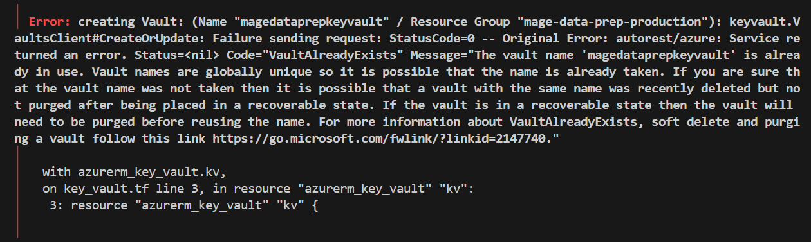

  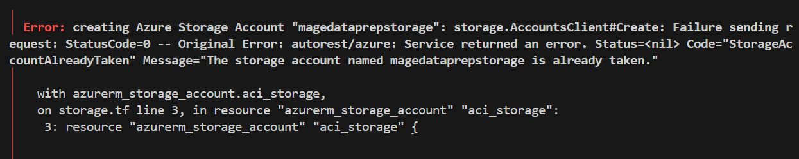

  ### Solution :

  Change name and add suffix number

### - Problem in authorization mage with azure

  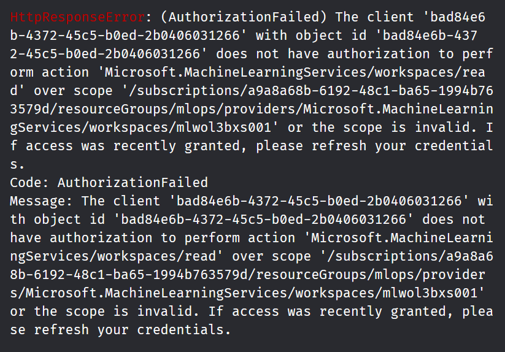

  ### Solution :

  Give secret key connection string

  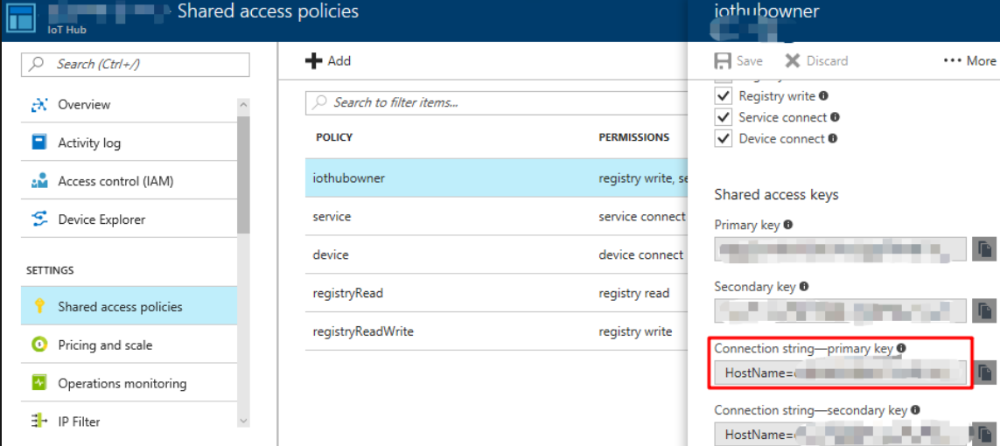

## USED TECHNOLOGIES
- Terraform - as Infrastructure-as-Code (IaC) provide setup azure services;
- MLFlow - for experiment tracking and model registry
- MageAI - for orchestration load, transform, train, inference, export;
- Azure container instances - for run mage and run model in cloud;
- Azure container registry - for storing registry image or model;
- Azure Blob Storage - for storing model files;
- Azure machine learning - for monitoring model;

## EXPERIMENT TRACKING AND MODEL REGISTRY
For this project I create experiment tracking and model registry as depicted below. You can check folder mlflow for registry model files.
- Experiment Tracking
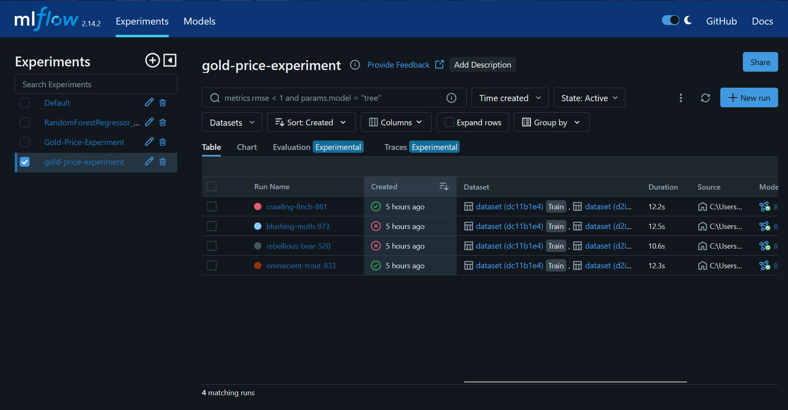
-Model Registry
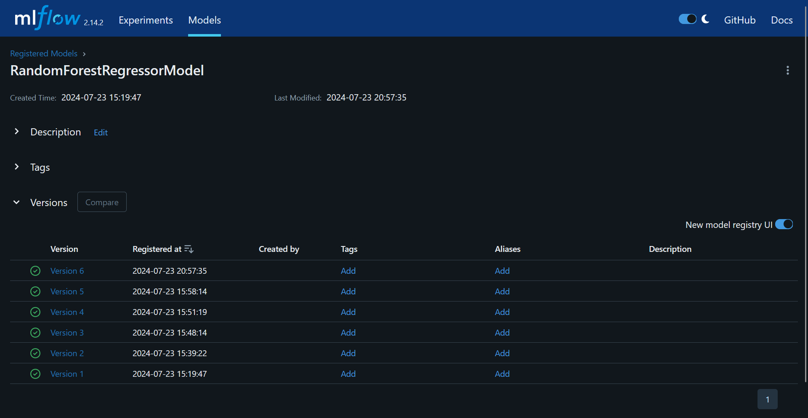

## DATASET & WORKFLOW ORCHESTRATION
Dataset for this project source using yfinance api and i clean and convert the data into csv file and i upload to azure blob storage. You can check folder mageai for the logic and machine learning pipeline.

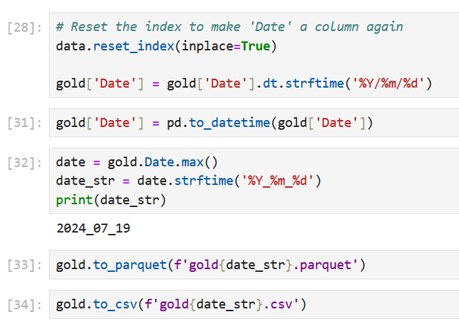

Here the orchestration from mage :

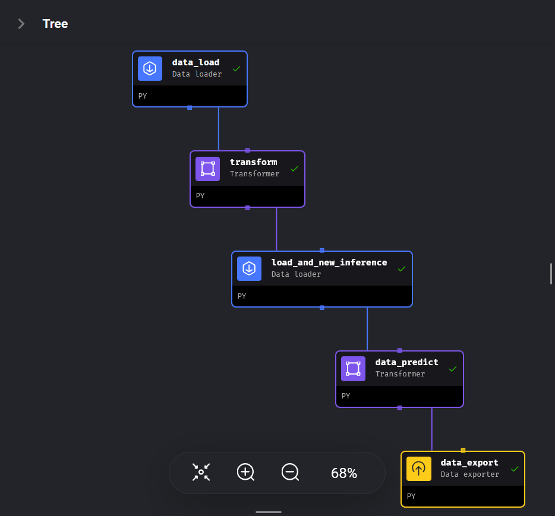

## MODEL DEPLOYMENT
For this project I create Dockerfile for step to create container using model, app.py file for the logic of the program, requirements.txt for dependencies and model as depicted below. You can check folder dockerize-model for all files to create docker image.

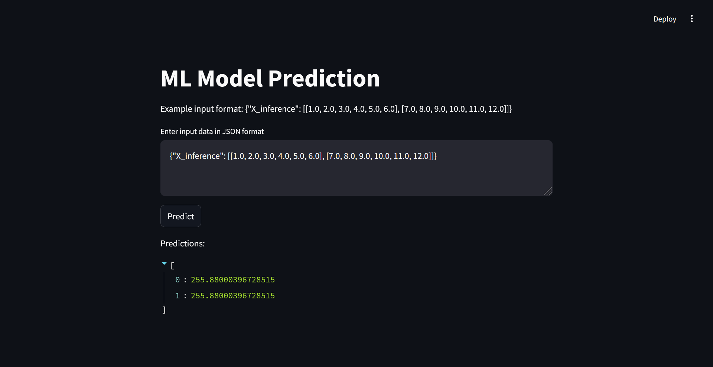

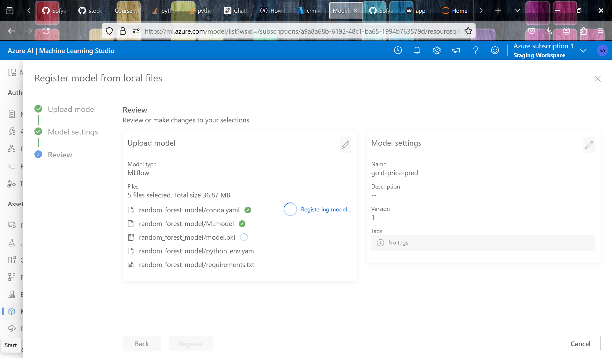

## MODEL MONITORING

Due to new installation in azure machine learning the data is not enough to generate metric or chart.

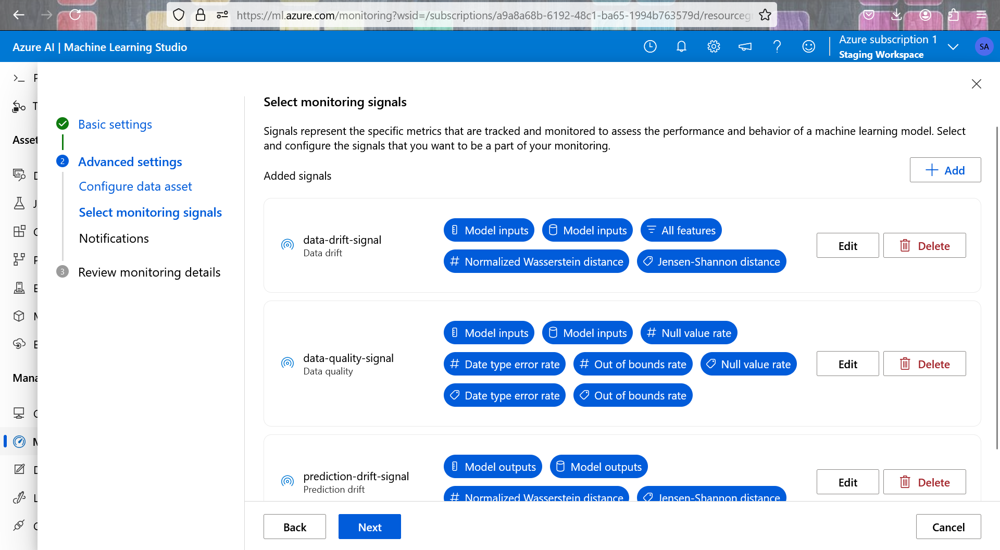

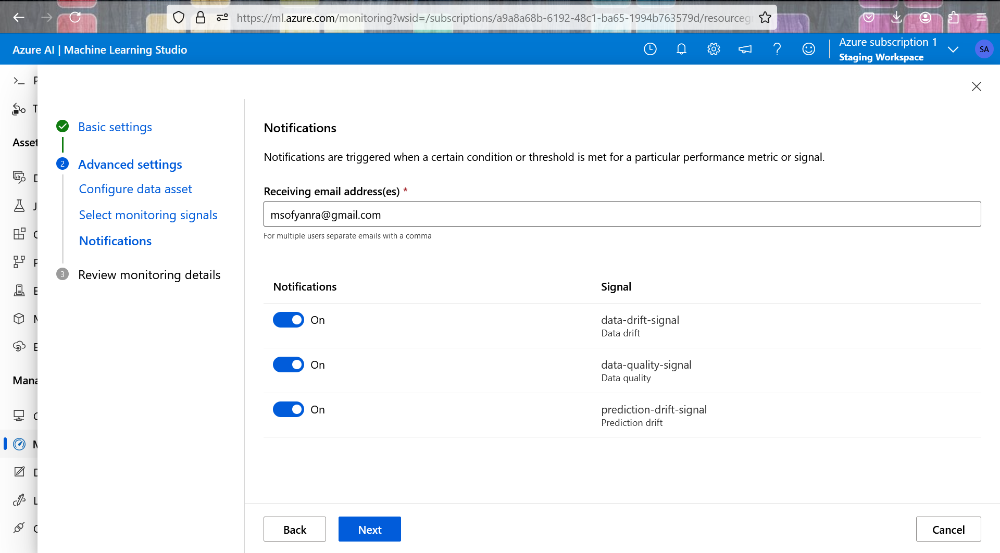

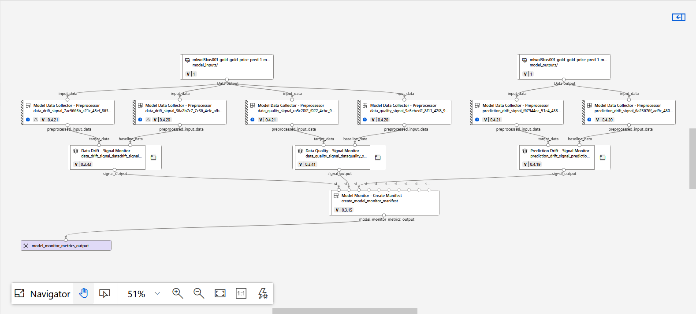

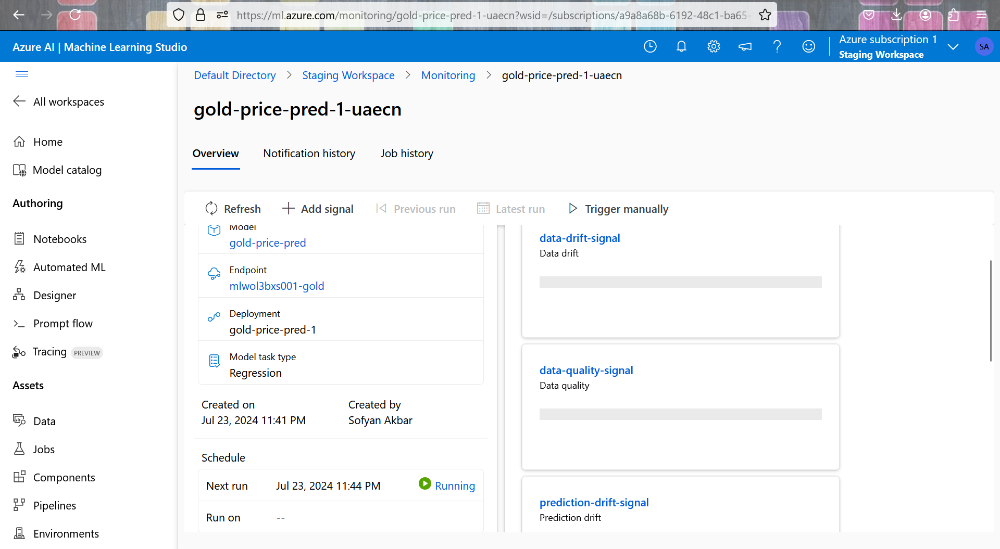

## Reproduce

## 1. Installation Terraform

I used Windows OS so for installation you can read the documentation in here :
> https://phoenixnap.com/kb/how-to-install-terraform

If you're successfully installed you can check with
`terraform --version`

## 2. Installation Mage - Orchestration Tool using Terraform in Azure

If you're confused with the installation Mage in Azure I recommend using official Mage documentation and downloading all files :

> https://github.com/mage-ai/mage-ai-terraform-templates/tree/master/azure

Save in your local folder
Open terminal or visual studio code
Enter to terraform folder

Open `variables.tf` file, fill and setting as you wish

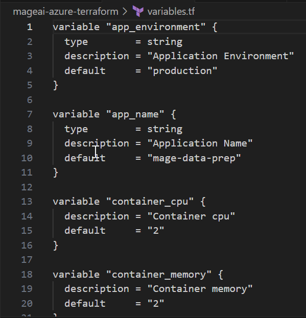

Run `terraform init` The terraform init command initializes a working directory containing configuration files and installs plugins for required providers.

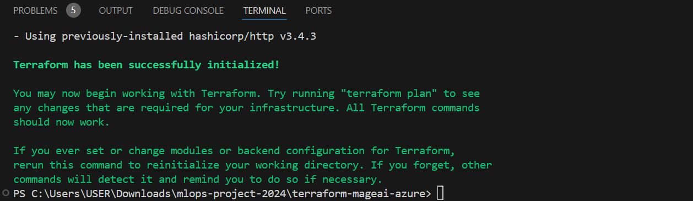

Run `terraform plan` The terraform plan command creates an execution plan, which lets you preview the changes that Terraform plans to make to your infrastructure.

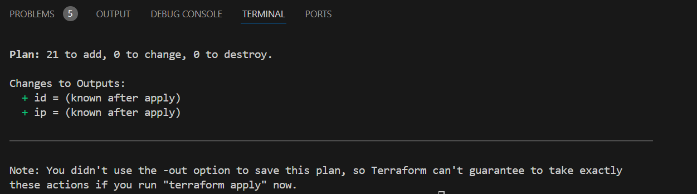

Check if everything is correct, if there are error fix an error

Run command `terraform apply` Type "yes" then press Enter. You can check into Azure

## Acknowledgments

I would like to extend my heartfelt gratitude to Alexey and the entire DataTalks.Club community for their invaluable contribution in organizing and hosting the Zoom camp, and generously sharing knowledge and expertise with participants, all free of charge.

Your dedication to fostering learning and professional development within the data community is truly commendable. Through the Zoom camp sessions, you have provided an invaluable platform for individuals to expand their skills, explore new technologies, and engage with industry experts in a supportive and collaborative environment.

Thank you, Alexey, and everyone at DataTalks.Club, for your unwavering dedication to education, collaboration, and community building. We look forward to continuing our journey of learning and discovery together.

